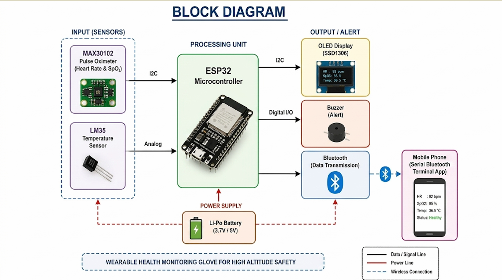
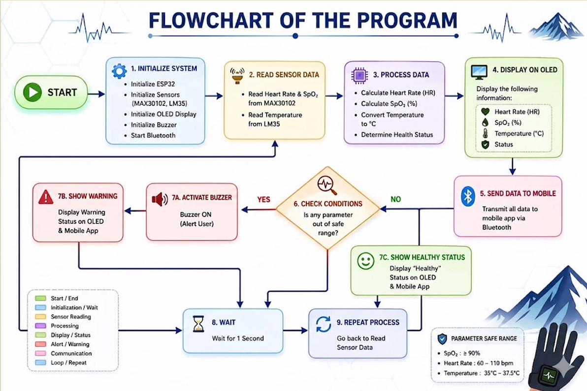
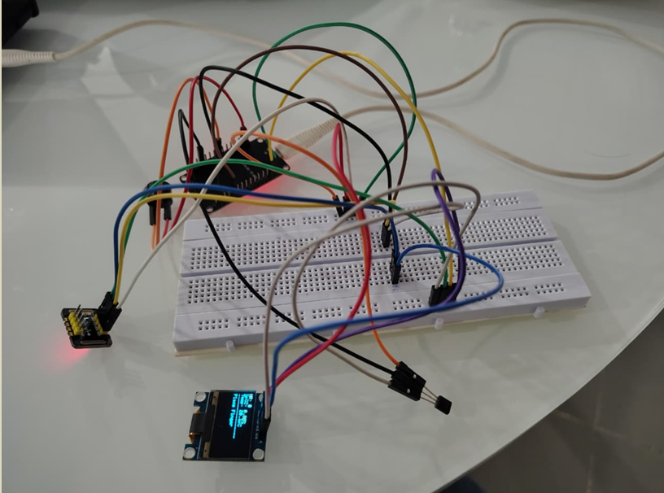
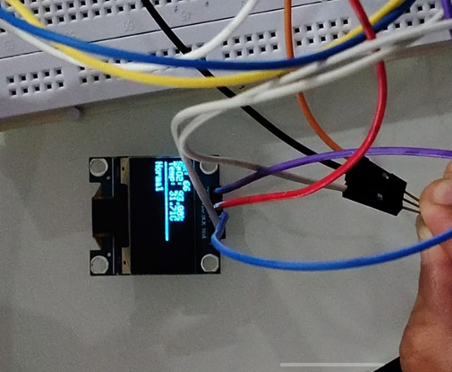
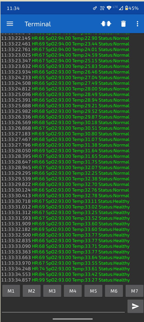
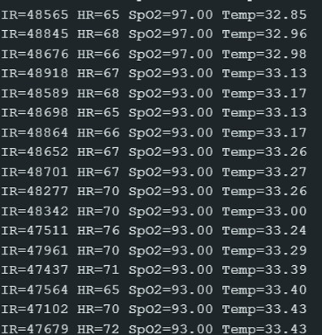
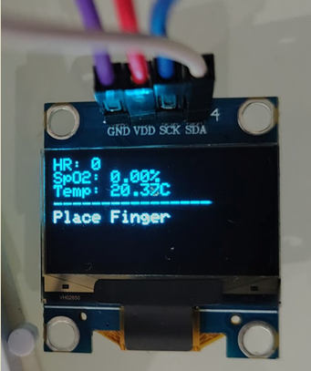

# Wearable IoT-Based Health Monitoring Glove for High-Altitude Safety

A wearable IoT-based health monitoring system built using the **ESP32 microcontroller** to monitor vital health parameters in high-altitude environments. The system continuously measures **Heart Rate (HR), Blood Oxygen Saturation (SpO₂), and Body Temperature**, displays the readings on an **OLED display**, transmits data to a mobile device via **Bluetooth**, and generates alerts during abnormal health conditions.

---

# Table of Contents

- Overview
- Project Highlights
- Objectives
- System Architecture
- Hardware Components
- Project Workflow
- Features
- Results
- Technologies Used
- Repository Structure
- Applications
- Future Work
- Author
- Acknowledgements
- License

---

# Overview

High-altitude environments pose significant health risks due to reduced oxygen levels, which may lead to altitude sickness, hypoxia, and other health complications.

This project introduces a wearable IoT-based health monitoring glove capable of continuously monitoring vital physiological parameters. Using biomedical sensors integrated with an ESP32 microcontroller, the system processes health data in real time and wirelessly transmits it to a mobile device for remote monitoring.

The system monitors:

- Heart Rate (HR)
- Blood Oxygen Saturation (SpO₂)
- Body Temperature

The measured values are displayed on an OLED display and sent to a mobile device through Bluetooth. Whenever abnormal health conditions are detected, the system immediately alerts the user using a buzzer.

---

# Project Highlights

- ESP32-based wearable IoT system
- Real-time Heart Rate monitoring
- Blood Oxygen Saturation (SpO₂) measurement
- Body Temperature monitoring
- OLED display for live health data
- Bluetooth communication with mobile devices
- Emergency alert using buzzer
- Portable and lightweight wearable design
- Low-cost implementation
- Real-time health monitoring

---

# Objectives

- Design a wearable health monitoring glove for high-altitude safety.
- Measure Heart Rate and Blood Oxygen Saturation.
- Monitor body temperature continuously.
- Detect abnormal health conditions.
- Transmit health data to a mobile device via Bluetooth.
- Provide real-time alerts for emergency situations.

---

# System Architecture

## Input Sensors

- MAX30102 Pulse Oximeter Sensor
- LM35 Temperature Sensor

## Processing Unit

- ESP32 Microcontroller

## Output Devices

- SSD1306 OLED Display
- Bluetooth Communication
- Mobile Phone
- Buzzer Alert

The ESP32 receives data from the biomedical sensors, processes the information, displays it on the OLED screen, transmits it to a mobile device using Bluetooth, and activates a buzzer whenever abnormal health conditions are detected.

---

# Hardware Components

| Component | Purpose |
|-----------|----------|
| ESP32 | Main Controller |
| MAX30102 | Heart Rate & SpO₂ Sensor |
| LM35 | Temperature Sensor |
| SSD1306 OLED Display | Display Health Parameters |
| Buzzer | Emergency Alert |
| Bluetooth | Wireless Communication |
| Li-Po Battery | Power Supply |

---

# Project Workflow

```text
START
   │
Initialize ESP32
   │
Initialize Sensors
   │
Read Heart Rate
Read SpO₂
Read Temperature
   │
Process Sensor Data
   │
Display Data on OLED
   │
Transmit Data via Bluetooth
   │
Check Threshold Values
   │
 ┌──────────────┐
 │Normal Values?│
 └──────┬───────┘
        │
   Yes  │  No
        │
Display Normal
        │
Activate Buzzer
Send Alert
        │
Repeat Monitoring
```

---

# Features

- Continuous Heart Rate Monitoring
- Continuous SpO₂ Monitoring
- Continuous Temperature Monitoring
- OLED Display Interface
- Bluetooth Communication
- Mobile Health Monitoring
- Emergency Alert System
- Portable Wearable Device
- Low Power Consumption
- Cost-effective Design

---

# Results

The developed prototype successfully monitored:

- Heart Rate
- Blood Oxygen Saturation (SpO₂)
- Body Temperature

The system successfully:

- Displayed live sensor data on the OLED display.
- Transmitted health data wirelessly via Bluetooth.
- Displayed health information on a mobile device.
- Generated buzzer alerts during abnormal health conditions.
- Operated as a portable and low-cost wearable health monitoring system.

---

# Project Demonstration

## Block Diagram



---

## Flow Chart



---

## Hardware Setup



---

## Live Health Monitoring



---

## Bluetooth Monitoring



---

## Serial Monitor Output



---

## User Interaction Interface



---

# Technologies Used

## Programming Language

- Embedded C
- Arduino

## Development Environment

- Arduino IDE

## Hardware Platform

- ESP32

## Sensors

- MAX30102
- LM35

## Communication

- Bluetooth

## Display

- SSD1306 OLED Display

---

# Repository Structure

```text
Wearable-IoT-Health-Monitoring-Glove/

│
├── results/
│   ├── Bluetooth_Monitoring.png
│   ├── Live_Health_Monitoring.png
│   ├── Serial_Monitor.png
│   ├── User_Interaction_Interface.png
│   ├── block_diagram.png
│   ├── flow_chart.png
│   └── hardware_setup.png
│
├── src/
│   └── health_monitoring_glove.ino
│
├── .gitignore
├── LICENSE
├── README.md
└── requirements.txt
```

---

# Applications

- High-Altitude Safety
- Trekking
- Mountaineering
- Military Personnel
- Remote Patient Monitoring
- Healthcare Monitoring
- Emergency Medical Assistance
- Wearable IoT Devices

---

# Future Work

- Cloud-based IoT monitoring
- Wi-Fi connectivity
- GPS-based emergency location tracking
- AI-powered health prediction
- Mobile application integration
- Battery optimization
- Additional biomedical sensors
- Compact wearable design

---

# Author

**Abhishek Alankara**

B.Tech – Electronics and Communication Engineering

SRM University-AP

**LinkedIn:** https://www.linkedin.com/in/abhishekalankara/

**GitHub:** https://github.com/abhishekalankara

---

# Acknowledgements

I would like to express my sincere gratitude to the faculty members and mentors of the Department of Electronics and Communication Engineering, SRM University-AP, for their valuable guidance and support throughout this project. I also acknowledge the open-source community for providing the software libraries and development tools that contributed to the successful implementation of this project.

---

# License

This project is licensed under the **MIT License**.

---

If you found this project helpful, consider giving this repository a **Star**.
